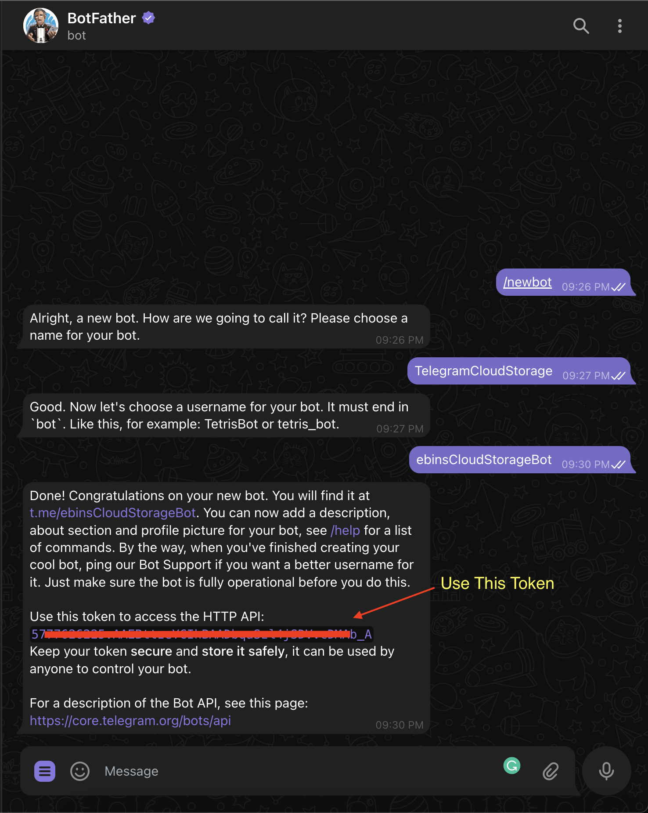
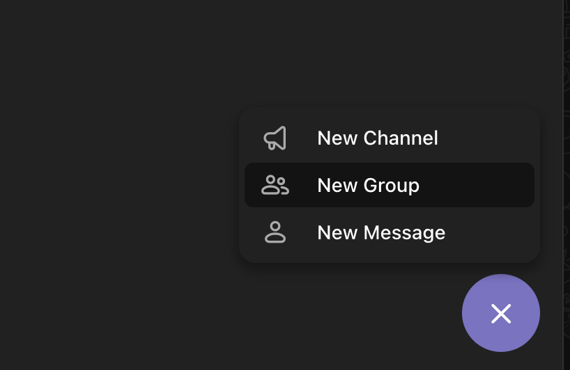
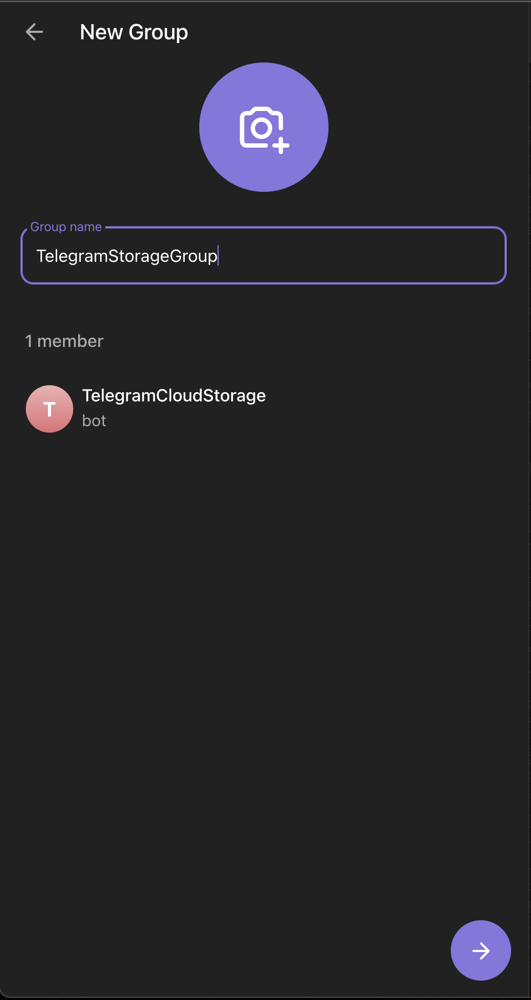
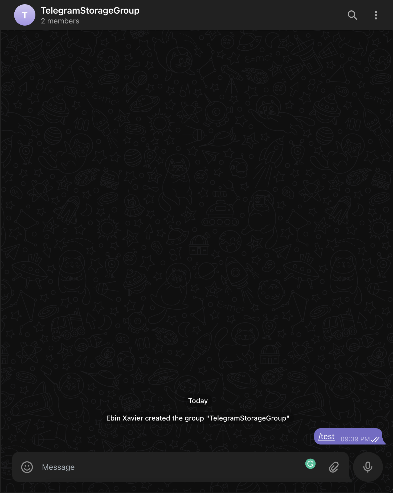
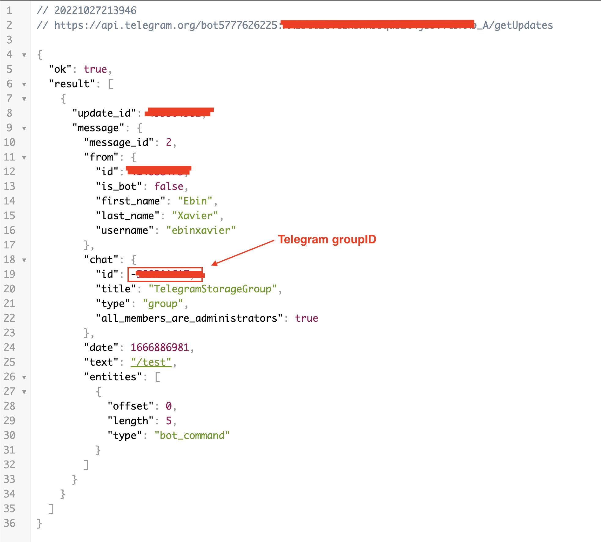

## Register New User

### 1. Get Telegram Bot Token

Open BotFather on your telegram and type `/newbot` and give a name to your bot eg: `TelegramCloudStorage` also give your bot's name eg: `ebinsCloudStorageBot`

- Create a bot
  
  Copy this `TOKEN` for step 2.

### 2. Get Telegram Group ID

We have to create a Telegram Group and add our `Bot` to it.

- Create Group
  
- Add our bot to it
  
- Give a group name
  
- Send a message `/test` to the group
  
- Now open this URL on browser by replacing `TOKEN` with yours: https://api.telegram.org/bot{TOKEN}/getUpdates
- Now you have got the `Group ID` or Chat ID
  
